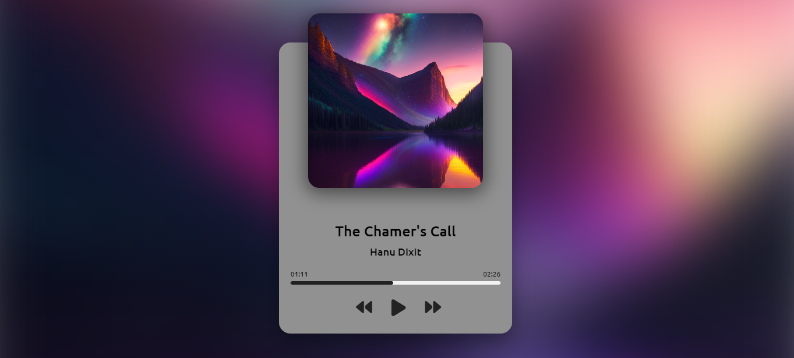

<h1 align="center"> Music Player 🎵 </h1>

Uma interface minimalista ao seu Player. ▪️◾▪️

  <a href="#-tecnologias">Tecnologias</a>&nbsp;&nbsp;&nbsp;|&nbsp;&nbsp;&nbsp;
  <a href="#-projeto">Projeto</a>&nbsp;&nbsp;&nbsp;

 

  

## 🚀 Tecnologias

Esse projeto foi desenvolvido com as seguintes tecnologias:

- HTML e CSS
- JavaScript

## 💻 Projeto

Conteúdo do projeto retirado de uma Série com 100 dias de JavaScript, com o desenvolvimento de pequenas aplicações nos mais diversos temas.  
Veja o canal do projeto através [DESSE LINK](https://www.youtube.com/@AsmrProg).
## 🔖 Layout

Você pode visualizar o resultado clincando neste [LINK](https://kiqprado.github.io/Music-Player/).

---
 
 

  
  &nbsp;&nbsp;&nbsp;|&nbsp;&nbsp;&nbsp;
  
 

